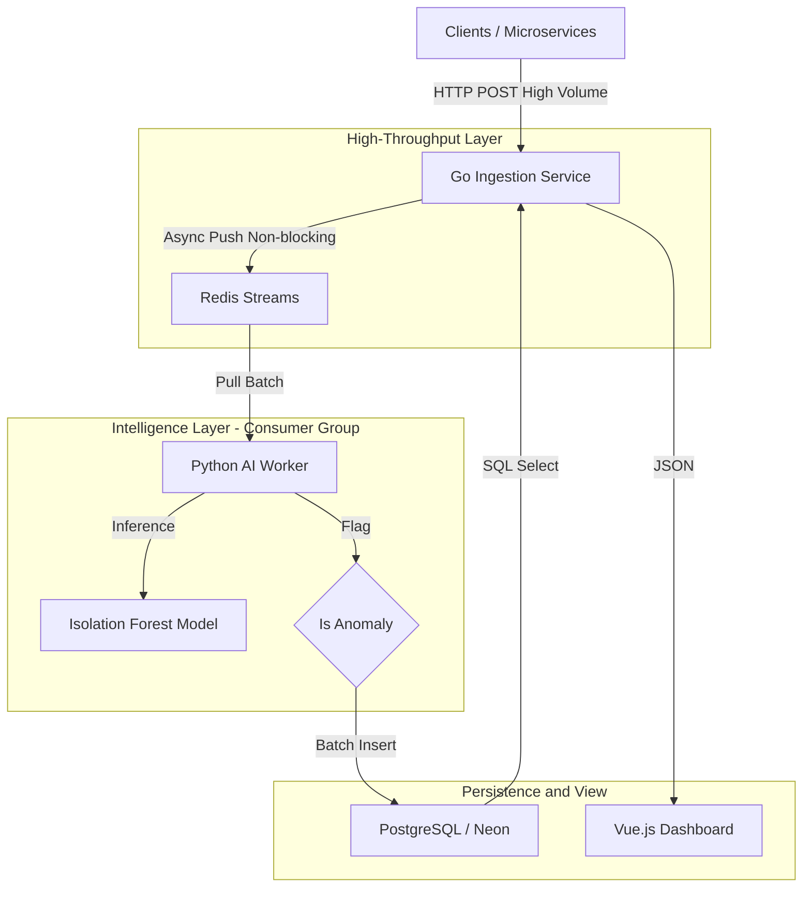
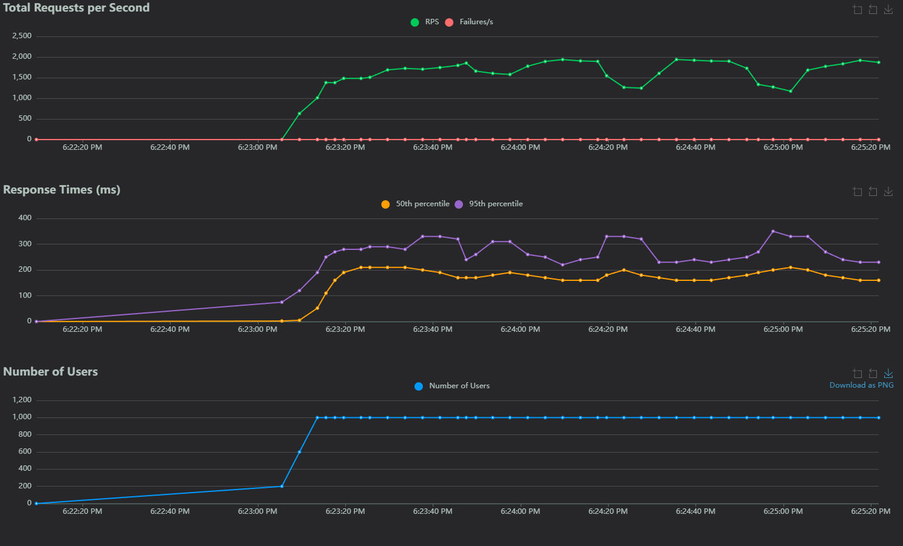
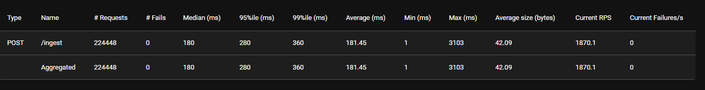

# Sentinel: Distributed Log Ingestion & Anomaly Detection Engine

<div >
    
    
    
    
    
</div>

Sentinel is a high-throughput, event-driven observability pipeline designed to ingest log streams, buffer traffic spikes, and detect system anomalies in real-time using Unsupervised Machine Learning.

## **Live Demo:** https://ingestion-service.vercel.app/

## System Architecture

The system utilizes a **Producer-Consumer** architecture to decouple ingestion from processing, ensuring high availability even during database write-latency spikes.



### 🚀 Key Engineering Features

* **Polyglot Microservices:** Leveraged **Go (Fiber)** for the ingestion layer to handle high concurrency (10k+ concurrent connections) and **Python** for the ML processing layer.
* **Backpressure Handling:** implemented **Redis Streams** as an event buffer. The system accepts requests faster than the database can write, preventing data loss during traffic bursts (The "Shock Absorber" pattern).
* **Unsupervised Anomaly Detection:** Uses an **Isolation Forest** algorithm (Scikit-Learn) to detect outliers in log patterns without requiring pre-labeled training data.
* **Resilient Deployment:** * **Local:** Fully containerized via Docker Compose.
  * **Cloud:** Deployed on Render (Compute) + Neon (Serverless Postgres) + Upstash (Serverless Redis).

## Performance Benchmarks

Load testing was conducted using **Locust** on a local development environment (8-core CPU, 16GB RAM). The system successfully decoupled ingestion from processing.

| Metric                           | Result               | Context                                                      |
| -------------------------------- | -------------------- | ------------------------------------------------------------ |
| **Throughput (Ingestion)** | **~2,000 RPS** | Sustained load with 0% failure rate.                         |
| **Ingestion Latency**      | **< 45ms**     | Time to acknowledge receipt to client.                       |
| **Processing Lag**         | **Async**      | Python worker drained the queue at ~500 logs/sec post-spike. |
| **Total Logs Processed**      | **200,000+**  | Even under heavy load (224k requests), the Redis buffer successfully absorbed the traffic spikes with 0% data loss.       |

*(Note: Throughput was limited by local Docker CPU context switching. In a production environment with dedicated instances, the Go API is capable of 10k+ RPS.)*

<br>


## 🛠️ How to Run Locally

Prerequisites: Docker & Docker Compose.

**1. Clone the repository**

```
git clone https://github.com/Vahsir7/sentinel.git
cd sentinel
```

**2.** Start the Stack
This single command spins up Redis, Postgres, Go API, and the Python Worker.
Open docker desktop and run the following command in the terminal:
```
docker-compose up --build
```

**3. Access the Dashboard**
Open `index.html` in your browser. It will automatically detect the local environment (`localhost:3080`).

**4. Simulate Traffic (Manual)**

Normal Log
```
curl -X POST http://localhost:3080/ingest \
     -H "Content-Type: application/json" \
     -d '{"service": "auth", "level": "info", "message": "User login success"}'
```
Anomaly Log (Length outlier)
```
curl -X POST http://localhost:3080/ingest \
     -H "Content-Type: application/json" \
     -d '{"service": "payment", "level": "error", "message": "TIMEOUT_ERROR_CRITICAL_FAILURE_RETRYING_CONNECTION_ABORTED"}'
```

**4. Simulate Traffic (Stress Test using Locust)**

```
pip install locust
locust -f locustfile.py
```

open `localhost:8089`
Set number of users (e.g. 1000), and ramp up (e.g 50) and url as http://localhost:3080
Press Start and observe how the go file handles so many request without failure

## ☁️ Cloud Deployment

The project is architected to run cloud infrastructure for demonstration purposes also.

| Service            | Provider          | Role                                       |
| ------------------ | ----------------- | ------------------------------------------ |
| **Compute**  | **Render**  | Hosting Docker containers for Go & Python. |
| **Database** | **Neon**    | Serverless PostgreSQL (IPv4 compatible).   |
| **Queue**    | **Upstash** | Serverless Redis.                          |
| **Frontend** | **Vercel**  | Static hosting for the Dashboard.          |

*Deployment Configuration is managed via `render.yaml` (Infrastructure as Code).*

## 📂 Project Structure

```
log-ingestor/
├── ingestion-service/      # Go API (The Gatekeeper)
│   ├── main.go             # Fiber App + Redis Producer
│   ├── go.mod              # Go Modules
│   ├── go.sum              # Go Modules Lockfile
│   └── Dockerfile          # Multi-stage build (Alpine)
├── processor-service/      # Python Worker (The Brain)
│   ├── main.py              # Redis Consumer + Anomaly Detection  
│   └── Dockerfile          # Python 3.11 + Dependencies
├── locustfile.py           # Load Testing Script (Locust)
├── docker-compose.yml      # Docker Compose Orchestration
├── render.yaml             # Render.com Deployment Config
├── README.md               # Project Documentation
└── index.html              # Vue.js Dashboard
```
